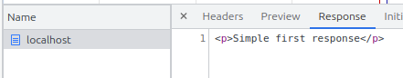
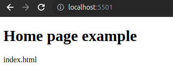
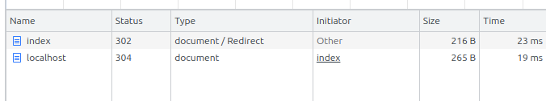
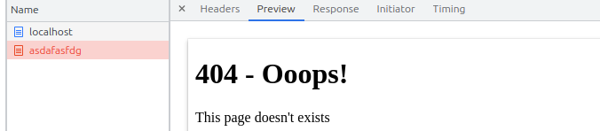
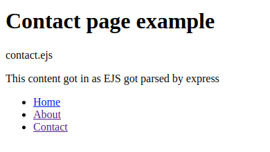
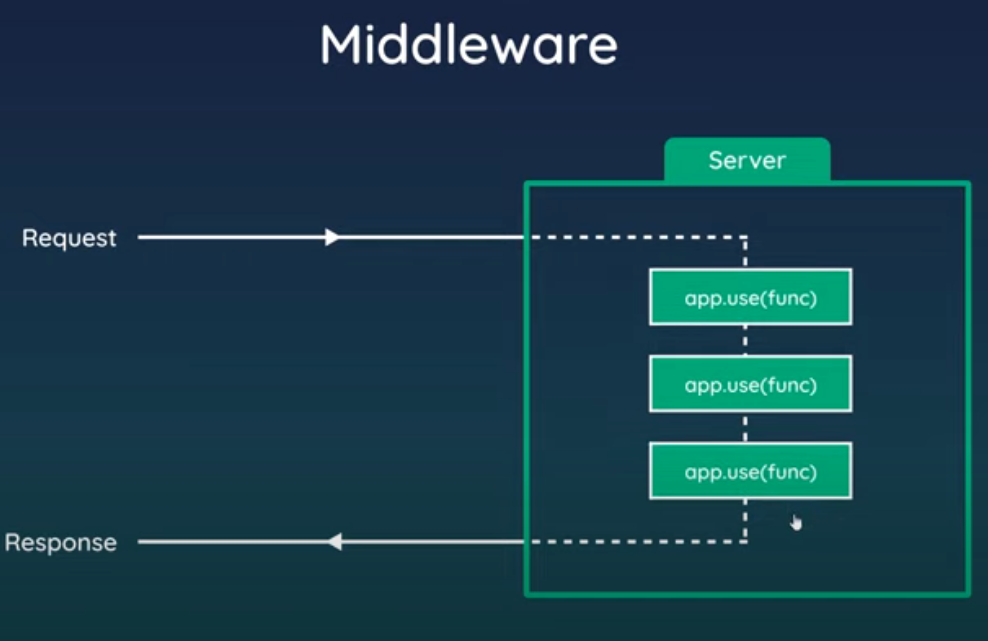
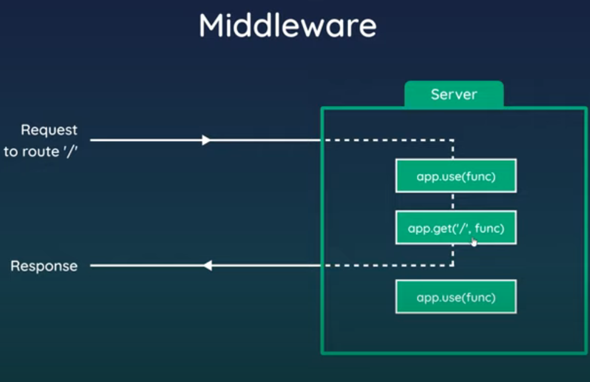

# Learning ExpressJS

- [Learning ExpressJS](#learning-expressjs)
  - [Primitive Node Server](#primitive-node-server)
  - [Getting Start with ExpressJS](#getting-start-with-expressjs)
    - [What is ExpressJS?](#what-is-expressjs)
    - [Installing ExpressJS](#installing-expressjs)
  - [First Express server](#first-express-server)
    - [Creating first route](#creating-first-route)
    - [Sending simple HTML response](#sending-simple-html-response)
    - [Sending HTML file as response](#sending-html-file-as-response)
    - [Redirecting](#redirecting)
    - [Unmatched routes and errors](#unmatched-routes-and-errors)
  - [Views in EJS](#views-in-ejs)
    - [Installing EJS](#installing-ejs)
    - [Setup EJS](#setup-ejs)
    - [Creating view file for EJS](#creating-view-file-for-ejs)
    - [Rendering a view](#rendering-a-view)
    - [Partials](#partials)
  - [Middleware](#middleware)
    - [Middleware placement, code organization](#middleware-placement-code-organization)
    - [Creating a Logger middleware](#creating-a-logger-middleware)
  - [Public files - Static](#public-files---static)
  - [Database and persistency](#database-and-persistency)
  - [MongoDB](#mongodb)
    - [Create MongoDB Account, Cluster and Collection](#create-mongodb-account-cluster-and-collection)
    - [Install mongoDB](#install-mongodb)
    - [Connect to MongoDB](#connect-to-mongodb)
    - [MongoDB CRUD Operations](#mongodb-crud-operations)
    - [Close MongoDB Connection](#close-mongodb-connection)
  - [Mongoose](#mongoose)
    - [Installing mongoose](#installing-mongoose)
    - [Establishing database connection](#establishing-database-connection)
    - [Mongoose Schema and Models](#mongoose-schema-and-models)
      - [Model methods](#model-methods)
      - [Model middlewares hooks](#model-middlewares-hooks)
      - [Saving and Getting data](#saving-and-getting-data)
  - [Snippet](#snippet)
    - [middleware to set response global variables](#middleware-to-set-response-global-variables)
  - [References](#references)

---

## Primitive Node Server

Below you can see a very basic server implementation using only Node, that will allow you to understand better how express works under the hood.

```js
// ./src/primitiveNodeServer/server.js

const http = require("http");
const fs = require("fs");

const server = http.createServer((req, res) => {
    // Response object
    res.setHeader("Content-Type", "text/html");

    // Simple router implementation
    let path = "./views"

    switch (req.url) {
        case "/":
            // Success example
            statusCode = 200
            path += "/index.html"
            break;
        case "/about":
            // Success example
            res.statusCode = 200
            path += "/about.html"
            break;
        case "/about-me":
            // Redirect example
            res.statusCode = 301
            res.setHeader("Location", "/about")
            break;
        default:
            // Not existing endpoint example
            res.statusCode = 404
            path += "/404.html"
            break;
    }

    // Simple view engine implementation
    fs.readFile(path, (error, data) => {
        try {
            res.write(data)
        } catch (e) {
            console.log(e, error)
        } finally {
            res.end()
        }
    })
});

server.listen(5500, "localhost", () => {
    console.log("Listening for requests on port 5500");
});
```

> See an example project on: `./src/primitiveNodeServer/`

## Getting Start with ExpressJS

### What is ExpressJS?

**GPT: What is ExpressJS?**

> Express.js, commonly known as Express, is a minimal and flexible web application framework for Node.js. It provides a set of features for building web and mobile applications quickly and efficiently. Express is widely used in the Node.js community and is known for its simplicity, ease of use, and robust set of features
>
> **Key features**:
>
> 1. **Routing:** Simple and efficient route handling for various HTTP methods.
> 2. **Middleware:** Modular functions to handle aspects of the request-response cycle.
> 3. **Template Engines:** Support for various template engines like EJS, Pug, and Handlebars.
> 4. **Static File Serving:** Built-in middleware for serving static files easily.
> 5. **HTTP Utility Methods:** Simplifies working with HTTP requests and responses.
> 6. **RESTful API Development:** Ideal for designing and implementing RESTful APIs.
> 7. **Flexibility:** Minimalistic and unopinionated, allowing developers to structure applications as they prefer.
> 8. **Widely Adopted:** Popular and widely used in the Node.js community.
> 9. **Performance:** Lightweight and fast, suitable for building scalable applications.
> 10. **Ecosystem:** Large and vibrant ecosystem with numerous third-party middleware and extensions.

### Installing ExpressJS

```sh
yarn add express

# OR

npm install express
```

## First Express server

Express doesn't require setup or anything, however you need to have a initial JS file that will be the main express server script on the project's root folder, normally this file is called `app.js` or `server.js`, here is a simple example how to create and start this basic server:

```js
// ./src/firstExpressServer/app.js

const express = require("express");

// Creating express app
const app = express();

// Setup port to listen for requests
const server = app.listen(5501, () => console.log(`Listening port: 5501`));
```

To run this server open terminal on it's root folder and run `yarn start`

**Output:**

```mono
yarn run v1.22.19
$ node app.js
Listening port: 5501
```

> To avoid keeping the server processes running after quit terminal or press `ctrl+c`, you can add a small script to force the server to close all processes before it gets closed [Closing server gracefully](../README.md#shutdown-server-gracefully)

### Creating first route

First let's create a route. To create a route we use express http-verb-like functions, `get`, `post`, `patch`, `delete`

On this simple static first server we only use `get`:

```js
app.get("/", (req, res) => {
  // Here's where we define the logics that occur using the request and response objects 
});
```

### Sending simple HTML response

To send a very simple response we use the function `send` from the response object:

```js
app.get("/", (req, res) => {
  res.send("<p>Simple first response</p>");
});
```

**Output:**



### Sending HTML file as response

Express also give us a function that allow us to send html files and not only strings with html, for that we use the function `sendFile`.

First let's create this `.html` file:

```html
<!-- ./src/firstExpressServer/src/views/index.html -->

<!DOCTYPE html>

<html lang="en">
    <head>
        <meta charset="UTF-8">
        <meta name="viewport" content="width=device-width, initial-scale=1.0">
        <title>First Express Server - index</title>
    </head>

    <body>
        <main>
            <h1>Home page example</h1>
            <p>index.html</p>
        </main>
    </body>
</html>
```

Now let's adjust our `app.js`:

```js
// ./src/firstExpressServer/app.js

...

// Routes, Requests and Responses
app.get("/", (req, res) => {
  res.sendFile("./src/views/index.html", { root: __dirname });
});
```

> **Notice:** on the first argument of `sendFile` function is a relative path, however this function by default uses absolute paths, that's why we need to use a second options argument to enforce where effectively is our project's root folder, so that the file can be found.
> `__dirname` returns the absolute from where it's called, instead of `__dirname` we could also use the `path` module that node provides, but let's keep it simple.

**Output:**



### Redirecting

To make a redirect using express we will use the function `redirect`:

```js
// ./src/firstExpressServer/app.js

// Routes, Requests and Responses

...

// Redirecting
app.get("/index", (req, res) => {
  res.redirect('/')
})
```

> **Notice:** In this case we don't need to worry about the response, because the redirect will only reroute the quest

**Output:**



### Unmatched routes and errors

To handle unmatched endpoints we are going the `use` function, to ensure our middleware will only be trigger if the route is unmatched we need to place this middleware after all our existing routes, and to ensure that our function will trigger to the correct moment we'll use the function  `status` chained with the `sendFile`

```js
// ./src/firstExpressServer/app.js

// Routes, Requests and Responses
app.get("/", (req, res) => {
  // res.send("<p>Simple first response</p>");
  res.sendFile("./src/views/index.html", { root: __dirname });
});

// Redirecting
app.get("/index", (req, res) => {
  res.redirect("/");
});

// Middleware to handler unmatched routes
app.use((req, res) => {
  res.status(404).sendFile("./src/views/404.html", { root: __dirname });
});
```

Since `asdafasfdg` doesn't match any of the endpoints we created the request will reach the middleware code we just created to handle 404 status, and respond with our html file:

**Output:**



## Views in EJS

**GPT: What is EJS?**

> JS (Embedded JavaScript) is a simple templating language that lets you generate HTML markup with JavaScript code embedded within it. It is commonly used in web development, particularly with Node.js and Express.js, to dynamically generate HTML content on the server side. EJS templates allow you to inject data into HTML files, making it easier to create dynamic and data-driven web pages.

### Installing EJS

```js
yarn add -D ejs
```

### Setup EJS

Within the `app.js` we need to instantiate EJS and put it to usage

```js
// app.js

// Creating express app

...

// Register view engine
app.set('view engine', 'ejs')
app.set('views', './src/views')

// Routes and endpoints handling

```

> **Notice:** in our case we added a second statement because our `views` folder isn't directly on the root folder, so we need to specify the relative path where our `views` folder is

### Creating view file for EJS

To create EJS views, we will use 90% HTML syntax, however the file name will have the extension `ejs`,
the difference is that express will parse the file and if we use `<% %>` it will allow us run javascript
on the server side, which means we can make our view more dynamic, most parte of the we just want use it for variables
or simple scripts that our server needs to handle specific aspects from our view,

```html
<!-- views/index.ejs -->

<!DOCTYPE html>
<html lang="en">
  <head>
      <meta charset="UTF-8">
      <meta name="viewport" content="width=device-width, initial-scale=1.0">
      <title>ExpressJS example - contact</title>
  </head>

  <body>
      <main>
          <h1>Contact page example</h1>
          <p>contact.ejs</p>
          <p><%= content %></p>
      </main>

      <nav>
          <ul>
              <li><a href="/index">Home</a></li>
              <li><a href="/about">About</a></li>
          </ul>
      </nav>
  </body>
</html>
```

> **Notice:** the only difference between HTML is really the usage of embedded Javascript `<%= content %>`

| Embed              | Description                                                                                                                                       |
| :----------------- | :------------------------------------------------------------------------------------------------------------------------------------------------ |
| `<% code_here %>`  | Executes JavaScript code without rendering it on the final HTML. Use for control flow or logic.                                                   |
| `<%= code_here %>` | Executes JavaScript code and renders its output on the final HTML. HTML-escapes the output to prevent XSS.                                        |
| `<%- code_here %>` | Executes JavaScript code and renders its output on the final HTML. Does not HTML-escape the output. Use when you trust the source of the content. |
| `<%# code_here %>` | Comments that won't render in the final HTML. Useful for adding comments within your EJS template.                                                |

### Rendering a view

To render a view with express we are going to use within the `get` a function called `render` from the response object we have:

```js
// app.js

...

// Routes and endpoints handling

...

app.get("/contact", (req, res) => {
    res.render('contact', { content: "This content got in as EJS got parsed by express" })
})
```

As use the function `render` has two arguments, 'contact' and an object {}, this object is where we send the variables
that our ejs view will use, so the output will  be like this:

**Output:**


### Partials

Since EJS are used to create multiple views it generate too much repeating code, to avoid that exist partials, that is small portions of code that can be included within a main EJS file so we don't have to keep rewriting code too much:

For instance, view you look or views, you will notice that it is constantly repeating the `head` and the `nav` elements, so without the usage of partial we would have to keep copying and pasting this code a lot, so we can make it become a partial, like this:

**Create partials folder:**

First lets create `/partials` folder

```tree
.
└── views
    ├── 404.html
    ├── about.html
    ├── contact.ejs
    ├── index.html
    └── partials
```

**Create partials and move code from `contact.ejs`:**

Within this folder let's create two `ejs` views, on for the `head` and the other for our `nav`

```tree
└── views
    ├── 404.html
    ├── about.html
    ├── contact.ejs
    ├── index.html
    └── partials
       └── partials
           ├── head.ejs
           └── nav.ejs
```

Now lets move the head from the `contact.ejs` view to the partial `head.ejs`

```html
<!-- partials/head.ejs -->
<head>
    <meta charset="UTF-8">
    <meta name="viewport" content="width=device-width, initial-scale=1.0">
    <title>ExpressJS example - <%= endpoint %></title>
</head>
```

> **Notice:** i added a embed to render the variable `endpoint` to make our head more dynamic

```html
<!-- partials/nav.ejs -->
<nav>
    <ul>
        <li><a href="/index">Home</a></li>
        <li><a href="/about">About</a></li>
        <li><a href="/contact">Contact</a></li>
    </ul>
</nav>
```

> **Notice:** there's a extra link for contact here

**Call and partials on `contact.ejs`:**

To include a partial we are going to used escaped javascript using `<%- %>` that will run and render the partial using the function `include`, like this:

```html
<!-- contact.ejs -->

<!DOCTYPE html>
<html lang="en">
  <%- include('./partials/head.ejs', {endpoint: 'contact' }) %>

  <body>
    <main>
      <h1>Contact page example</h1>
      <p>contact.ejs</p>
      <p><%= content %></p>
    </main>

    <%- include('./partials/nav.ejs') %>
  </body>
</html>
```

**Output:**



## Middleware

**GPT: What's a middleware?**

> Middleware is a software component that sits between a web application's request and response. It can execute code before and after the main processing of a request, modify requests and responses, and enhance or modify the application's behavior by performing specific tasks during the request-response cycle. It has
access to the request and response objects, allowing it to perform various functions such as checking user authentication, logging information, or handling errors.



On express to build a middleware we use the function `use`, technically our `get` function it's also a middleware since it works with and between request and response, however `get` only triggers if it's made get request, same as `post` function that triggers only for post requests, while `use` function is triggered for every request is made.

### Middleware placement, code organization

A very important point to emphasize is that middleware only works between request and response, therefore if we send a response back to the client before a middleware is trigger, the middleware left out will never be called, look an example:



Which means we must organize our code in such a way that our routes do not responds before a middleware if the middleware response should be trigger before such response.

In or example we are handling error view after all our gets, that's because our middleware should only return if no endpoint gets a response, meaning that that page doesn't exists:

```js
// app.js

...

// Routes and endpoints handling
app.get("/", (req, res) => {
    res.sendFile('./src/views/index.html', { root: __dirname })
})

app.get("/about", (req, res) => {
    res.sendFile('./src/views/about.html', { root: __dirname })
})

app.get("/about-us", (req, res) => {
    res.redirect('/about')
})

app.get("/contact", (req, res) => {
    res.render('contact', { content: "This content got in as EJS got parsed by express" })
})

// Only will be reached if no response has been sent
app.use((req, res) => {
    res.status(404).sendFile('./src/views/404.html', { root: __dirname })
})
```

### Creating a Logger middleware

Create a middleware is pretty simple with express, we just need find the right placement and add call the `use` function, on this example we need to log data from request before it gets any response, so the right place for it will be before our routes handlers:

```js
// Register view engine

...

// Middlewares
// Logger
app.use((req, res, next) => {
  let log = ` => ${req.method} ${req.url}, Parameters: ${JSON.stringify(req.params)}`;

  console.log(log);
  next();
});

// Routes and endpoints handling
```

> **Notice:** for this middleware we not only got as argument request and response, but also a `next` a function that allows the application to move on, so each can reach our routes handlers and produce a response.

If we want to increment our logs and use a third-party lib like [morgan](https://github.com/expressjs/morgan) for instance.

## Public files - Static

To be able to allow out client to access files static files like assets or images, we need to setup our server like this:

```js
// Middlewares
// Static files

app.use(express.static('public'))
```

The argument `'public'` specify a folder where our static files will be available publicly to the client

```tree
.
├── public
└── src
    ├── assets
    │   └── images
    └── views
        └── partials
```

So every file within the public folder can be used on the clients browser, so we can use a builder to output processed files directly there or we could put the files we  want directly there, something like images ou css, all that would be available to the client

## Database and persistency

**GPT: Whats the differences between SQL and NoSQL concept?**

> **SQL (Structured Query Language):**
>
> **Data Structure:** Tables with rows and columns.
> **Schema:** Fixed schema, predefined structure.
> **Scalability:** Vertical scaling.
> **Transactions:** ACID compliant.
> **Query Language:** Standardized SQL.
> **Use Cases:** Complex queries, transactions, well-defined schema applications (e.g., banking systems).
>
> **NoSQL (Not Only SQL):**
>
> **Data Structure:** Flexible, supports unstructured or semi-structured data.
> **Schema:** Dynamic schema or schema-less.
> **Scalability:** Horizontal scaling across multiple servers or nodes.
> **Transactions:** May sacrifice full ACID compliance for performance.
> **Query Language:** Database-specific languages (e.g., MongoDB query language).
> **Use Cases:** Rapidly changing data, real-time applications, horizontal scalability (e.g., social media platforms, big data applications).
>
> Each type has its own advantages, and the choice depends on the specific needs of the project.
>
> **Brief example of both:**
>
> **SQL Example:**
>
> ```sql
> -- Creating a table in SQL
> CREATE TABLE users (
>     id INT PRIMARY KEY,
>     username VARCHAR(50),
>     email VARCHAR(100)
> );
>
> -- Inserting data
> INSERT INTO users (id, username, email) VALUES (1, 'john_doe', '<john@example.com>');
>
> -- Querying data
> SELECT * FROM users WHERE username = 'john_doe';
>
> ```
>
> In this SQL example, we're creating a table `users`, inserting a record, and then querying for users with the username 'john_doe'.
>
> **NoSQL (MongoDB) Example:**
>
> ```js
> // Creating a document in MongoDB
> db.users.insertOne({
>     _id: 1,
>     username: 'john_doe',
>     email: 'john@example.com'
> });
>
> // Querying data
> db.users.find({ username: 'john_doe' });
> ```
>
> In this NoSQL (MongoDB) example, we're creating a document in the `users` collection and querying for users with the username 'john_doe'. Note the flexibility in the structure; fields can vary between documents.

## MongoDB

**GPT: Whats is MongoDB?***

> MongoDB is a NoSQL document-oriented database that provides flexible and scalable data storage. It stores data in JSON-like BSON documents, allowing for dynamic schema and efficient querying. MongoDB is widely used for its ease of use, scalability, and ability to handle large volumes of unstructured data.

### Create MongoDB Account, Cluster and Collection

1. Create a MongoDB Atlas Account

   - Visit the [MongoDB Atlas website](https://www.mongodb.com/cloud/atlas).
   - Sign up or log in.

2. Create a New Cluster

   - Click "Build a Cluster" and choose a cloud provider and region.
   - Configure your cluster and provide a name.

3. Database Access and User Creation

   - Go to "Database Access" and add a new database user.
   - Set user privileges for read and write access.
   - Save the user credentials.

4. Connect to Your Cluster

   - Back in the cluster view, click "Connect" and whitelist your IP.
   - Choose "Connect Your Application" and copy the connection string.

5. Connect to MongoDB from Your Application

   - Use the copied connection string in your application.
   - Copy the provided connection string. It should look like `mongodb+srv://<username>:<password>@<cluster-name>.mongodb.net/<dbname>`

6. Create Your First Collection

   - Use MongoDB Compass, Atlas Dashboard, or code to create a new database and collection.

### Install mongoDB

```sh
npm install mongodb

# OR

yarn add mongodb
```

### Connect to MongoDB

Establish a connection to the MongoDB server.

 ```js
 const { MongoClient } = require('mongodb');
 const uri = 'mongodb://localhost:27017';
 const client = new MongoClient(uri, { useNewUrlParser: true, useUnifiedTopology: true });

 async function connect() {
   await client.connect();
   console.log('Connected to MongoDB');
 }
 // Call the connect function to establish the connection
 connect();
 ```

### MongoDB CRUD Operations

Perform basic CRUD (Create, Read, Update, Delete) operations.

**Create:**

```js
async function insertDocument(db, document) {
  const result = await db.collection('collectionName').insertOne(document);
  console.log(`Document inserted with ID: ${result.insertedId}`);
}
```

**Read:**

```js
async function findDocuments(db, query) {
  const cursor = await db.collection('collectionName').find(query);
  const documents = await cursor.toArray();
  console.log('Documents:', documents);
}
```

**Update:**

```js
async function updateDocument(db, filter, update) {
  const result = await db.collection('collectionName').updateOne(filter, update);
  console.log(`Matched ${result.matchedCount} document(s) and modified ${result.modifiedCount} document(s)`);
}
```

**Delete:**

```js
async function deleteDocument(db, filter) {
  const result = await db.collection('collectionName').deleteOne(filter);
  console.log(`Deleted ${result.deletedCount} document(s)`);
}
```

### Close MongoDB Connection

Always close the connection when done.

```js
async function close() {
  await client.close();
  console.log('Connection to MongoDB closed');
}

// Call the close function when finished
 close();
 ```

## Mongoose

But to make things simpler we can use Mongoose:

**GPT: What is mongoose?**

> Mongoose is a Node.js ODM library for MongoDB. It simplifies MongoDB interactions by providing schema-based models, middleware support, and a query API. With Mongoose, you can define data structures, create models, and perform CRUD operations in a more organized and efficient manner. It acts as a bridge between your application and MongoDB, making database interactions in Node.js applications more intuitive and structured.

### Installing mongoose

```sh
npm install mongoose

# OR

yarn add mongoose
```

### Establishing database connection

In order to establish connection we are going to update our server code:

```js
require("dotenv").config();

const express = require("express");
const mongoose = require("mongoose");

const PORT = process.env.PORT || 3000;
const DATABASE_URL = process.env.DATABASE_URL;

// Creating express app
const app = express();

// Connected to MongoDB using mongoose and Starting listening
mongoose
  .connect(DATABASE_URL)
  .then(() =>
    app.listen(PORT, () =>
      console.log(`Connected and Listening to http://localhost:${PORT}`)
    )
  )
  .catch((error) => console.error(error));
```

> **Notice:** we had to change our server, so we can connect first and then start listening to the server, we also had do add the [dotenv](../README.md#dotenv) to handler our sensitive data

### Mongoose Schema and Models

Mongoose seems to me a bit like ActiveRecord, it has functions that wrap and enhance what we could call plain js models/objects.
With Mongoose, everything is derived from a Schema. Let's get a reference to it and define our post.

```js
// models/post.js
// Imports
const {model, Schema} = require("mongoose");

const postSchema = new Schema({
  title: { type: String, required: true },
  body: { type: String, required: true }
}, {
  timestamps: true
})

module.exports = model("Post", postSchema);
```

The usage of this model would be:

```js
// server.js
// Imports
const Post = require("./src/models/post")

const newPost = new Post({ title: 'Silence makes me happy', body: "Shhhh............." });
```

#### Model methods

As mention on Mongoose everything derives from the schema so to add functions to our Model we need to create methods withing the schema itself

```js
// models/post.js

const { model, Schema } = require("mongoose");

const postSchema = new Schema(
  {
    title: { type: String, required: true },
    snippet: { type: String, required: false },
    body: { type: String, required: true },
  },
  {
    timestamps: true,
  }
);

// Define a method to generate the snippet from the body
postSchema.methods.generateSnippet = (maxLength = 150) => {
  return this.body.length > maxLength
    ? this.body.substring(0, maxLength) + "..."
    : this.body;
};

module.exports = model("Post", postSchema);
```

#### Model middlewares hooks

Mongoose models also allow us to use hooks to trigger middlewares that can work just like `ActiveRecord` callbacks, like `before_save` and etc..

```js
// models/post.js

const { model, Schema } = require("mongoose");

const postSchema = new Schema(
  {
    title: { type: String, required: true },
    snippet: { type: String, required: false },
    body: { type: String, required: true },
  },
  {
    timestamps: true,
  }
);

postSchema.methods.generateSnippet = (maxLength = 150) => {
  return this.body.length > maxLength
    ? this.body.substring(0, maxLength) + "..."
    : this.body;
};

// Middleware to automatically generate snippet
postSchema.pre("save", (next) => {
  this.snippet = this.generateSnippet();
  next();
});

module.exports = model("Post", postSchema);
```

Notice that in this example the hook called `pre`, this allow us to run the middleware, as our model gets `save`, let's see other hooks we could use:

| Middleware Hook                           | Description                                   |
| ----------------------------------------- | --------------------------------------------- |
| `pre('save', function(next))`             | Runs before a document gets saved.            |
| `pre('validate', function(next))`         | Runs before the document's validation.        |
| `pre('remove', function(next))`           | Runs before a document is removed.            |
| `pre('updateOne', function(next))`        | Runs before the `updateOne` operation.        |
| `post('save', function(doc, next))`       | Runs after a document is saved.               |
| `post('remove', function(doc))`           | Runs after a document is removed.             |
| `post('findOneAndUpdate', function(doc))` | Runs after the `findOneAndUpdate` operation.  |
| `pre('findOneAndDelete', function(next))` | Runs before the `findOneAndDelete` operation. |
| `pre('findOneAndUpdate', function(next))` | Runs before the `findOneAndUpdate` operation. |

#### Saving and Getting data

To save data using Mongoose we need to get a request

## Snippet

### middleware to set response global variables

That middleware allow our views to have access to the variable without have to send it locally as we include the view

```js
//
// Middleware to define local variables
app.use((req, res, next) => {
  res.locals.baseURL = req.baseUrl;
    res.locals.path = req.path;
  next();
});
```

## References

[Express](https://expressjs.com/)
[EJS view engine](https://ejs.co/)
[Express node Crash Course](https://www.youtube.com/playlist?list=PL4cUxeGkcC9jsz4LDYc6kv3ymONOKxwBU)
