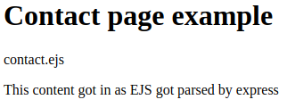
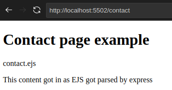
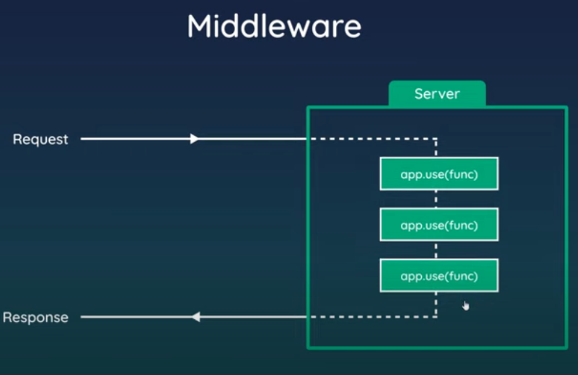
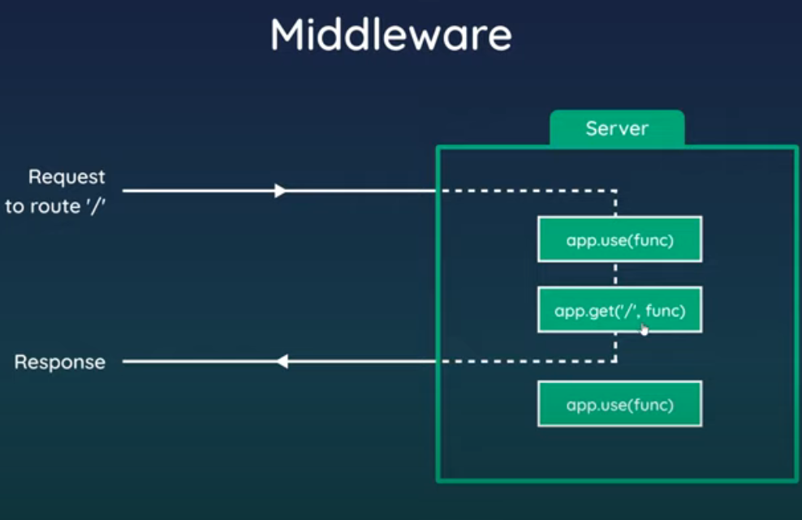
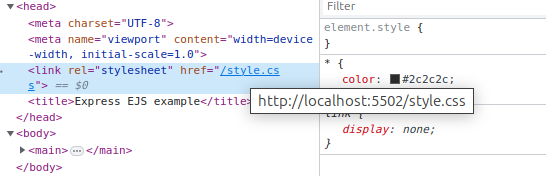
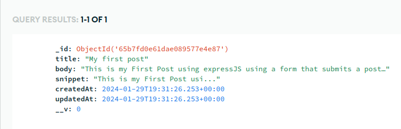

# Learning ExpressJS

- [Learning ExpressJS](#learning-expressjs)
  - [Primitive Node Server](#primitive-node-server)
  - [Getting Start with ExpressJS](#getting-start-with-expressjs)
    - [What is ExpressJS?](#what-is-expressjs)
    - [Installing ExpressJS](#installing-expressjs)
  - [First Express server](#first-express-server)
    - [Creating first route](#creating-first-route)
    - [Sending simple HTML response](#sending-simple-html-response)
    - [Sending HTML file as response](#sending-html-file-as-response)
    - [Redirecting](#redirecting)
    - [Unmatched routes and errors](#unmatched-routes-and-errors)
  - [Views in EJS](#views-in-ejs)
    - [Installing EJS](#installing-ejs)
    - [Setup EJS](#setup-ejs)
    - [Creating view file for EJS](#creating-view-file-for-ejs)
    - [Rendering a EJS view](#rendering-a-ejs-view)
    - [EJS Partials](#ejs-partials)
      - [Create `head.ejs` partial](#create-headejs-partial)
      - [Render partial in a view](#render-partial-in-a-view)
  - [Middleware](#middleware)
    - [Middleware placement, code organization](#middleware-placement-code-organization)
    - [Creating a Logger middleware](#creating-a-logger-middleware)
      - [`next()` callback](#next-callback)
  - [Public files - Static files](#public-files---static-files)
    - [To guarantee public folder access](#to-guarantee-public-folder-access)
  - [Database and persistency](#database-and-persistency)
    - [MongoDB](#mongodb)
      - [Create MongoDB Account, Cluster and Collection](#create-mongodb-account-cluster-and-collection)
      - [Install mongoDB](#install-mongodb)
      - [Connect to MongoDB](#connect-to-mongodb)
      - [MongoDB data types](#mongodb-data-types)
      - [MongoDB CRUD Operations](#mongodb-crud-operations)
      - [Close MongoDB Connection](#close-mongodb-connection)
    - [Mongoose](#mongoose)
      - [Installing mongoose](#installing-mongoose)
      - [Establishing database connection](#establishing-database-connection)
      - [Schema and Models](#schema-and-models)
        - [Create Schema](#create-schema)
        - [Define and Export Model](#define-and-export-model)
        - [Create custom functions](#create-custom-functions)
        - [Instantiating Models](#instantiating-models)
        - [Instance functions](#instance-functions)
        - [Schema hooks](#schema-hooks)
        - [Saving data](#saving-data)
  - [Snippet](#snippet)
    - [Simple logger](#simple-logger)
  - [References](#references)

---

## Primitive Node Server

Below you can see a very basic server implementation using only Node, that will allow you to understand better how express works under the hood.

```js
// ./src/primitiveNodeServer/server.js

const http = require("http");
const fs = require("fs");

const server = http.createServer((req, res) => {
    // Response object
    res.setHeader("Content-Type", "text/html");

    // Simple router implementation
    let path = "./views"

    switch (req.url) {
        case "/":
            // Success example
            statusCode = 200
            path += "/index.html"
            break;
        case "/about":
            // Success example
            res.statusCode = 200
            path += "/about.html"
            break;
        case "/about-me":
            // Redirect example
            res.statusCode = 301
            res.setHeader("Location", "/about")
            break;
        default:
            // Not existing endpoint example
            res.statusCode = 404
            path += "/404.html"
            break;
    }

    // Simple view engine implementation
    fs.readFile(path, (error, data) => {
        try {
            res.write(data)
        } catch (e) {
            console.log(e, error)
        } finally {
            res.end()
        }
    })
});

server.listen(5500, "localhost", () => {
    console.log("Listening for requests on port 5500");
});
```

> See an example project on: `./src/primitiveNodeServer/`

## Getting Start with ExpressJS

### What is ExpressJS?

**GPT: What is ExpressJS?**

> Express.js, commonly known as Express, is a minimal and flexible web application framework for Node.js. It provides a set of features for building web and mobile applications quickly and efficiently. Express is widely used in the Node.js community and is known for its simplicity, ease of use, and robust set of features
>
> **Key features**:
>
> 1. **Routing:** Simple and efficient route handling for various HTTP methods.
> 2. **Middleware:** Modular functions to handle aspects of the request-response cycle.
> 3. **Template Engines:** Support for various template engines like EJS, Pug, and Handlebars.
> 4. **Static File Serving:** Built-in middleware for serving static files easily.
> 5. **HTTP Utility Methods:** Simplifies working with HTTP requests and responses.
> 6. **RESTful API Development:** Ideal for designing and implementing RESTful APIs.
> 7. **Flexibility:** Minimalistic and unopinionated, allowing developers to structure applications as they prefer.
> 8. **Widely Adopted:** Popular and widely used in the Node.js community.
> 9. **Performance:** Lightweight and fast, suitable for building scalable applications.
> 10. **Ecosystem:** Large and vibrant ecosystem with numerous third-party middleware and extensions.

### Installing ExpressJS

```sh
yarn add express

# OR

npm install express
```

## First Express server

Express doesn't require setup or anything, however you need to have a initial JS file that will be the main express server script on the project's root folder, normally this file is called `app.js` or `server.js`, here is a simple example how to create and start this basic server:

```js
// ./src/firstExpressServer/app.js

const express = require("express");

// Creating express app
const app = express();

// Setup port to listen for requests
const server = app.listen(5501, () => console.log(`Listening http://localhost:5501`));
```

To run this server open terminal on it's root folder and run `yarn start`

**Output:**

```mono
yarn run v1.22.19
$ node app.js
Listening port: 5501
```

> To avoid keeping the server processes running after quit terminal or press `ctrl+c`, you can add a small script to force the server to close all processes before it gets closed [Closing server gracefully](../README.md#shutdown-server-gracefully)

### Creating first route

First let's create a route. To create a route we use express http-verb-like functions, `get`, `post`, `patch`, `delete`

On this simple static first server we only use `get`:

```js
app.get("/", (req, res) => {
  // Here's where we define the logics that occur using the request and response objects 
});
```

### Sending simple HTML response

To send a very simple response we use the function `send` from the response object:

```js
app.get("/", (req, res) => {
  res.send("<p>Simple first response</p>");
});
```

**Output:**


### Sending HTML file as response

Express also give us a function that allow us to send html files and not only strings with html, for that we use the function `sendFile`.

First let's create this `.html` file:

```html
<!-- ./src/firstExpressServer/src/views/index.html -->

<!DOCTYPE html>

<html lang="en">
    <head>
        <meta charset="UTF-8">
        <meta name="viewport" content="width=device-width, initial-scale=1.0">
        <title>First Express Server - index</title>
    </head>

    <body>
        <main>
            <h1>Home page example</h1>
            <p>index.html</p>
        </main>
    </body>
</html>
```

Now let's adjust our `app.js`:

```js
// ./src/firstExpressServer/app.js

...

// Routes, Requests and Responses
app.get("/", (req, res) => {
  res.sendFile("./src/views/index.html", { root: __dirname });
});
```

> **Notice:** on the first argument of `sendFile` function is a relative path, however this function by default uses absolute paths, that's why we need to use a second options argument to enforce where effectively is our project's root folder, so that the file can be found.
> `__dirname` returns the absolute from where it's called, instead of `__dirname` we could also use the `path` module that node provides, but let's keep it simple.
>
> **Notice 2:** if we import `path` or `express` as ES6 module, meaning, using `import` the `__dirname` is not defined so we need to do it manually:
>
>```js
> // when we use import instead of require, __dirname is not defined, so we need to do it manually
> const __dirname = path.dirname(new URL(import.meta.url).pathname);
>```

**Output:**


### Redirecting

To make a redirect using express we will use the function `redirect`:

```js
// ./src/firstExpressServer/app.js

// Routes, Requests and Responses

...

// Redirecting
app.get("/index", (req, res) => {
  res.redirect('/')
})
```

> **Notice:** In this case we don't need to worry about the response, because the redirect will only reroute the quest

**Output:**


### Unmatched routes and errors

To handle unmatched endpoints we are going the `use` function, to ensure our middleware will only be trigger if the route is unmatched we need to place this middleware after all our existing routes, and to ensure that our function will trigger to the correct moment we'll use the function  `status` chained with the `sendFile`

```js
// ./src/firstExpressServer/app.js

// Routes, Requests and Responses
app.get("/", (req, res) => {
  // res.send("<p>Simple first response</p>");
  res.sendFile("./src/views/index.html", { root: __dirname });
});

// Redirecting
app.get("/index", (req, res) => {
  res.redirect("/");
});

// Middleware to handler unmatched routes
app.use((req, res) => {
  res.status(404).sendFile("./src/views/404.html", { root: __dirname });
});
```

Since `asdafasfdg` doesn't match any of the endpoints we created the request will reach the middleware code we just created to handle 404 status, and respond with our html file:

**Output:**


## Views in EJS

**GPT: What is EJS?**

> JS (Embedded JavaScript) is a simple templating language that lets you generate HTML markup with JavaScript code embedded within it. It is commonly used in web development, particularly with Node.js and Express.js, to dynamically generate HTML content on the server side. EJS templates allow you to inject data into HTML files, making it easier to create dynamic and data-driven web pages.

### Installing EJS

```js
yarn add -D ejs
```

### Setup EJS

Within the `app.js` we need to instantiate EJS and put it to usage

```js
// ./src/expressEJSExample/app.js

...

// Register view engine
app.set("view engine", "ejs");
app.set("views", "./src/views/");
```

> **Notice:** In our case we added a second statement because our `views` folder isn't directly on the root folder, so we need to specify the relative path where our `views` folder is.

### Creating view file for EJS

To create EJS views, we will use 90% HTML syntax, however the file name will have the extension `ejs`,
the difference is that express will parse the file and if we use `<% %>` it will allow us to embed javascript
on the server side, which means we can make our view more dynamic

```html
<!-- ./src/expressEJSExample/src/views/index.ejs -->

<!DOCTYPE html>
<html lang="en">
  <head>
    <meta charset="UTF-8">
    <meta name="viewport" content="width=device-width, initial-scale=1.0">
    <title>Express EJS example - contact</title>
  </head>

  <body>
    <main>
      <h1>Contact page example</h1>
      <p>contact.ejs</p>
      <p><%= content %></p>
    </main>
  </body>
</html>
```

> **Notice:** The only difference between HTML is really the usage of embedded Javascript `<%= content %>`

| Embed              | Description                                                                                                                                       |
| :----------------- | :------------------------------------------------------------------------------------------------------------------------------------------------ |
| `<% code_here %>`  | Executes JavaScript code without rendering it on the final HTML. Use for control flow or logic.                                                   |
| `<%= code_here %>` | Executes JavaScript code and renders its output on the final HTML. HTML-escapes the output to prevent XSS.                                        |
| `<%- code_here %>` | Executes JavaScript code and renders its output on the final HTML. Does not HTML-escape the output. Use when you trust the source of the content. |
| `<%# code_here %>` | Comments that won't render in the final HTML. Useful for adding comments within your EJS template.                                                |

### Rendering a EJS view

To render a view with express we are going to use the response object function `render` within a route:

```js
// ./src/expressEJSExample/app.js

...

app.get("/contact", (req, res) => {
    res.render('contact', { content: "This content got in as EJS got parsed by express" })
})
```

The function `render` has two arguments, first the view name - on the folder we specified on our engine configuration -, and an object {}, this object is where we send variables that the EJS view will embed, so the output will be like this:

**Output:**



### EJS Partials

EJS also have away to create and render  partials  within a view, for instance, when we create new plain EJS views constantly we need to repeat the `head` element, so without the usage of partial we would have to keep copying and pasting this code a lot, its possible make it become a partial:

#### Create `head.ejs` partial

```tree
└── views
    ├── 404.html
    ├── about.html
    ├── contact.ejs
    ├── index.html
    └── partials
       └── partials
           └── head.ejs
```

Now lets move the head code from the views to the file `head.ejs`

```html
<!-- ./src/expressEJSExample/src/views/partials/head.ejs -->

<head>
    <meta charset="UTF-8">
    <meta name="viewport" content="width=device-width, initial-scale=1.0">
    <title>Express EJS example</title>
</head>
```

#### Render partial in a view

To include a partial we are going to used escaped embed javascript using `<%- %>` that will run and render the partial using the function `include`, like this:

```html
<!-- ./src/expressEJSExample/src/views/contact.ejs -->

<!DOCTYPE html>
<html lang="en">
  <%- include('./partials/head.ejs') %>

  <body>
    <main>
      <h1>Home page example</h1>
      <p>index.html</p>
    </main>
  </body>
</html>
```

**Output:**



## Middleware

**GPT: What's a middleware?**

> Middleware is a software component that sits between a web application's request and response. It can execute code before and after the main processing of a request, modify requests and responses, and enhance or modify the application's behavior by performing specific tasks during the request-response cycle. It has
access to the request and response objects, allowing it to perform various functions such as checking user authentication, logging information, or handling errors.



On express to build a middleware we use the function `use`, technically our `get` function it's also a middleware since it works with and between request and response, however `get` only triggers if it's made get request, same as `post` function that triggers only for post requests, while `use` function is triggered for every request made.

### Middleware placement, code organization

It's very important that the middleware is placed correctly because if we send a response back to the client before a middleware gets called, it will not be called:



So the code must be organized in such a way that routes do not responds before all it's related middleware has been called.

On the example, we are using a middleware to handle unmatched endpoints, so we placed it after all routes, that's because our middleware should only rbe called if no endpoint matches and responds the request.

```js
// ./src/expressEJSExample/app.js

...

// Routes, Requests and Responses
app.get("/", (req, res) => {
  res.render("index");
});

app.get("/about", (req, res) => {
  res.render("about");
});

// Redirecting
app.get("/index", (req, res) => {
  res.redirect("/");
});

app.get("/contact", (req, res) => {
  res.render("contact", {
    content: "This content got in as EJS got parsed by express",
  });
});

// Middleware to handler unmatched routes
app.use((req, res) => {
  res.status(404).render("404");
});
```

### Creating a Logger middleware

Create a middleware is pretty simple with express, we just need find the right place and add call the `use` function. On this example we need to log data from every request, so the right place it will be before our routes matches and responds the request:

```js
// ./src/expressEJSExample/app.js

...

// Logger Middleware
app.use((req, res, next) => {
  let log = ` => ${req.method} ${req.url}, Parameters: ${JSON.stringify(req.body)}`;

  console.log(log);
  next();
});

// Routes, Requests and Responses
```

#### `next()` callback

On this middleware we need to apply our logic prior to the routes, but since it's just a logger we won't have any kind of response or return, we need to use the callback `next` from the http object, this function allows us to force the application to move on, although we do not have a response.

> If you want to increment your logs you can use a third-party lib like [morgan](https://github.com/expressjs/morgan).

## Public files - Static files

To allow client access to certain files like like css, assets, and images, we need to setup our server to enable a public folder that will enable the client access these files regardless od CORS:

```js
// ./src/expressEJSExample/app.js

...

// Static files
app.use(express.static("public"));
```

> The parameter send as "public" specify the folder name within our project root folder where the static files will be available publicly to the client.

```tree
.
├── public
│   // static files
└── src
    └── views
        └── partials
```

### To guarantee public folder access

To ensure that our public folder will be available throughout our application, we can define the application root path using a middleware to define global variable

```js
// ./src/expressEJSExample/app.js

// Global variables
app.use((req, res, next) => {
  res.locals.baseURL = req.baseUrl;
  next();
})
```

So now within any view or partial we will provide a variable called `baseURL`, so let's say we have a public style.css, we would add it on the head partial like this:

```ejs
<!-- ./src/expressEJSExample/src/views/partials/head.ejs -->

<head>
  <meta charset="UTF-8" />
  <meta name="viewport" content="width=device-width, initial-scale=1.0" />
  <link rel="stylesheet" href="<%= baseURL %>/style.css">
  <title>Express EJS example</title>
</head>
```

> `baseURL` variable in this example returns `http://localhost:5502`, which means that our `style.css` on the client side of the application is located on `http://localhost:5502/style.css`



## Database and persistency

**GPT: Whats the differences between SQL and NoSQL concept?**

> **SQL (Structured Query Language):**
>
> **Data Structure:** Tables with rows and columns.
> **Schema:** Fixed schema, predefined structure.
> **Scalability:** Vertical scaling.
> **Transactions:** ACID compliant.
> **Query Language:** Standardized SQL.
> **Use Cases:** Complex queries, transactions, well-defined schema applications (e.g., banking systems).
>
> **NoSQL (Not Only SQL):**
>
> **Data Structure:** Flexible, supports unstructured or semi-structured data.
> **Schema:** Dynamic schema or schema-less.
> **Scalability:** Horizontal scaling across multiple servers or nodes.
> **Transactions:** May sacrifice full ACID compliance for performance.
> **Query Language:** Database-specific languages (e.g., MongoDB query language).
> **Use Cases:** Rapidly changing data, real-time applications, horizontal scalability (e.g., social media platforms, big data applications).
>
> Each type has its own advantages, and the choice depends on the specific needs of the project.
>
> **Brief example of both:**
>
> **SQL Example:**
>
> ```sql
> -- Creating a table in SQL
> CREATE TABLE users (
>     id INT PRIMARY KEY,
>     username VARCHAR(50),
>     email VARCHAR(100)
> );
>
> -- Inserting data
> INSERT INTO users (id, username, email) VALUES (1, 'john_doe', '<john@example.com>');
>
> -- Querying data
> SELECT * FROM users WHERE username = 'john_doe';
>
> ```
>
> In this SQL example, we're creating a table `users`, inserting a record, and then querying for users with the username 'john_doe'.
>
> **NoSQL (MongoDB) Example:**
>
> ```js
> // Creating a document in MongoDB
> db.users.insertOne({
>     _id: 1,
>     username: 'john_doe',
>     email: 'john@example.com'
> });
>
> // Querying data
> db.users.find({ username: 'john_doe' });
> ```
>
> In this NoSQL (MongoDB) example, we're creating a document in the `users` collection and querying for users with the username 'john_doe'. Note the flexibility in the structure; fields can vary between documents.

### MongoDB

**GPT: Whats is MongoDB?***

> MongoDB is a NoSQL document-oriented database that provides flexible and scalable data storage. It stores data in JSON-like BSON documents, allowing for dynamic schema and efficient querying. MongoDB is widely used for its ease of use, scalability, and ability to handle large volumes of unstructured data

#### Create MongoDB Account, Cluster and Collection

1. Create a MongoDB Atlas Account

   - Visit the [MongoDB Atlas website](https://www.mongodb.com/cloud/atlas).
   - Sign up or log in.

2. Create a New Cluster

   - Click "Build a Cluster" and choose a cloud provider and region.
   - Configure your cluster and provide a name.

3. Database Access and User Creation

   - Go to "Database Access" and add a new database user.
   - Set user privileges for read and write access.
   - Save the user credentials.

4. Connect to Your Cluster

   - Back in the cluster view, click "Connect" and whitelist your IP.
   - Choose "Connect Your Application" and copy the connection string.

5. Connect to MongoDB from Your Application

   - Use the copied connection string in your application.
   - Copy the provided connection string. It should look like `mongodb+srv://<username>:<password>@<cluster-name>.mongodb.net/<dbname>`

6. Create Your First Collection

   - Use MongoDB Compass, Atlas Dashboard, or code to create a new database and collection.

#### Install mongoDB

```sh
npm install mongodb

# OR

yarn add mongodb
```

#### Connect to MongoDB

Establish a connection to the MongoDB server.

 ```js
 const { MongoClient } = require('mongodb');
 const uri = 'mongodb://localhost:27017';
 const client = new MongoClient(uri, { useNewUrlParser: true, useUnifiedTopology: true });

 async function connect() {
   await client.connect();
   console.log('Connected to MongoDB');
 }
 // Call the connect function to establish the connection
 connect();
 ```

#### MongoDB data types

| Mongoose Data Type | MongoDB Native Data Type |
| ------------------ | ------------------------ |
| String             | String                   |
| Number             | Number                   |
| Date               | Date                     |
| Buffer             | Binary Data              |
| Boolean            | Boolean                  |
| Mixed              | Dynamic                  |
| ObjectId           | ObjectId                 |
| Array              | Array                    |

#### MongoDB CRUD Operations

Perform basic CRUD (Create, Read, Update, Delete) operations.

**Create:**

```js
async function insertDocument(db, document) {
  const result = await db.collection('collectionName').insertOne(document);
  console.log(`Document inserted with ID: ${result.insertedId}`);
}
```

**Read:**

```js
async function findDocuments(db, query) {
  const cursor = await db.collection('collectionName').find(query);
  const documents = await cursor.toArray();
  console.log('Documents:', documents);
}
```

**Update:**

```js
async function updateDocument(db, filter, update) {
  const result = await db.collection('collectionName').updateOne(filter, update);
  console.log(`Matched ${result.matchedCount} document(s) and modified ${result.modifiedCount} document(s)`);
}
```

**Delete:**

```js
async function deleteDocument(db, filter) {
  const result = await db.collection('collectionName').deleteOne(filter);
  console.log(`Deleted ${result.deletedCount} document(s)`);
}
```

#### Close MongoDB Connection

Always close the connection when done.

```js
async function close() {
  await client.close();
  console.log('Connection to MongoDB closed');
}

// Call the close function when finished
 close();
 ```

### Mongoose

But to make things simpler we can use Mongoose:

**GPT: What is mongoose?**

> Mongoose is a Node.js ODM library for MongoDB. It simplifies MongoDB interactions by providing schema-based models, middleware support, and a query API. With Mongoose, you can define data structures, create models, and perform CRUD operations in a more organized and efficient manner. It acts as a bridge between your application and MongoDB, making database interactions in Node.js applications more intuitive and structured.

#### Installing mongoose

```sh
npm install mongoose

# OR

yarn add mongoose
```

#### Establishing database connection

Since our application is highly dependent of database connection, we are going to use mongoose `connect` async function to make the required connection and only than start to listen for requests on the respective port, notice that if something goes wrong with the connect the application won't work, and it will log an error message.

```js
// ./src/expressBlogExample/app.js

require("dotenv").config();

const express = require("express");
const mongoose = require("mongoose");

const PORT = process.env.PORT || 3000;
const DATABASE_URL = process.env.DATABASE_URL;

// Creating express app
const app = express();

//
// Mongoose database connection first, only then starts listening to the server
mongoose
  .connect(DATABASE_URL)
  .then(() =>
    app.listen(PORT, () =>
      console.log(
        `Connected on database and listening on:\nhttp://localhost:${PORT}`
      )
    )
  )
  .catch((error) => console.error(error));
```

> **Notice:** We added [dotenv](../README.md#dotenv) to the application so it can handle credentials and sensitive data

#### Schema and Models

Mongoose seems a bit like `ActiveRecord`, it has functions that wrap and enhance what we could call plain js models/objects.

With Mongoose, everything is derived from a Schema. So to create a model we need first define it's schema:

##### Create Schema

To create schema we need to import the `Schema` class from `mongoose`, the schema will receive two objects as argument, the first is the structure of the schema where you define what field or attributes from your model. The second argument is an option object.

This are the schema data types and properties:

| Mongoose Data Type | Description                              | Schema Properties                                       |
| ------------------ | ---------------------------------------- | ------------------------------------------------------- |
| String             | Text data (e.g., name, description)      | `{ type: String, required: true }`                      |
| Number             | Numeric data (e.g., age, quantity)       | `{ type: Number, min: 0, max: 100 }`                    |
| Date               | Represents a date and time               | `{ type: Date, default: Date.now }`                     |
| Buffer             | Binary data (e.g., images)               | `{ type: Buffer }`                                      |
| Boolean            | Represents true/false values             | `{ type: Boolean, default: true }`                      |
| Mixed              | Dynamic schema for unstructured data     | `{ type: Mixed }`                                       |
| ObjectId           | MongoDB ObjectID, used for relationships | `{ type: mongoose.Schema.Types.ObjectId, ref: 'User' }` |
| Array              | Array of values (e.g., tags)             | `{ type: [String], default: ['tag1', 'tag2'] }`         |

**Schema example:**

```js
const mongoose = require('mongoose');


const userSchema = new mongoose.Schema({
  firstName: { type: String, required: true }, 
  lastName: { type: String, required: true },
  age: { type: Number, min: 18 },
  email: { type: String, required: true, unique: true },
}, { timestamps: true });
```

> The option parameter `timestamps` automatically adds `createdAt` and `updatedAt` fields.

##### Define and Export Model

To define models with Mongoose we need to import the `model` function, this function receives only two arguments, `model_name` and `model_schema`, so basically the model implements the schema and when we use the model object it will only wrap the schema and delegate the fields and etc to the schema itself

```js
const {model, Schema} = require('mongoose');

// Creates the schema
const userSchema = new Schema({
  firstName: { type: String, required: true }, 
  lastName: { type: String, required: true },
  age: { type: Number, min: 18 },
  email: { type: String, required: true, unique: true },
}, { timestamps: true });

// Define model and exports
module.exports = model('User', userSchema);
```

##### Create custom functions

Like mentioned the model delegate it's behavior to it's schema, because in Mongoose everything is based on the schema, so to add a custom function we need to implement it directly into the schema object:

```js
const {model, Schema} = require('mongoose');

// Creates the schema
const userSchema = new Schema({
  firstName: { type: String, required: true }, 
  lastName: { type: String, required: true },
  age: { type: Number, min: 18 },
  email: { type: String, required: true, unique: true },
}, { timestamps: true });

// Custom function
userSchema.methods.fullName = () => [this.firstName, this.lastName].join(" ")

// Define model and exports
module.exports = model('User', userSchema);
```

##### Instantiating Models

To instantiate a model first we need to import the created model like this:

```js
// import
const User = require('./models/user')

// Instantiating mode object
const newUser = new User({
  firstName: 'John',
  lastName: 'Doe',
  age: 25,
  email: 'john@example.com',
});

```

 >**Notice:** Object functions that triggers database communication are all async, so be sure to handle it accordingly

##### Instance functions

Soon as we instantiate a model we are going have access to various functions to handle it's persistency and retrieval:

| Method                | Description                                           |
| --------------------- | ----------------------------------------------------- |
| `create()`            | Create a new document(s) in the database              |
| `save()`              | Save a document to the database (instance method)     |
| `insertMany()`        | Insert multiple documents into the collection         |
| `find()`              | Find documents that match the specified criteria      |
| `findOne()`           | Find one document that matches the specified criteria |
| `findById()`          | Find a document by its ID                             |
| `findByIdAndUpdate()` | Find a document by its ID and update it               |
| `findByIdAndDelete()` | Find a document by its ID and delete it               |
| `updateOne()`         | Update the first document that matches the criteria   |
| `updateMany()`        | Update all documents that match the criteria          |
| `deleteOne()`         | Delete the first document that matches the criteria   |
| `deleteMany()`        | Delete all documents that match the criteria          |
| `countDocuments()`    | Count documents that match the specified criteria     |
| `aggregate()`         | Perform aggregation operations on the collection      |

##### Schema hooks

Mongoose models and schema also give us `hooks` to trigger middlewares that can work depending on the data action or state very similar to what we got on Rails `ActiveRecord` callbacks like `before_save`, `after_save` and etc..

| Hook                                      | Description                                   |
| ----------------------------------------- | --------------------------------------------- |
| `pre('save', function(next))`             | Runs before a document gets saved.            |
| `pre('validate', function(next))`         | Runs before the document's validation.        |
| `pre('remove', function(next))`           | Runs before a document is removed.            |
| `pre('updateOne', function(next))`        | Runs before the `updateOne` operation.        |
| `post('save', function(doc, next))`       | Runs after a document is saved.               |
| `post('remove', function(doc))`           | Runs after a document is removed.             |
| `post('findOneAndUpdate', function(doc))` | Runs after the `findOneAndUpdate` operation.  |
| `pre('findOneAndDelete', function(next))` | Runs before the `findOneAndDelete` operation. |
| `pre('findOneAndUpdate', function(next))` | Runs before the `findOneAndUpdate` operation. |

> **Notice:** In Mongoose middleware functions (like the `pre` hook), it's important not to use arrow functions `(() => {})`. Arrow functions don't have their own `this` context, and using `this` inside an arrow function will not refer to the document being processed.

**Schema hook example:**

```js
// ./src/expressBlogExample/src/models/post.js

const { model, Schema } = require("mongoose");

// Create the schema
const postSchema = new Schema(
  {
    title: { type: String, required: true },
    snippet: { type: String, required: false },
    body: { type: String, required: true },
  },
  { timestamps: true }
);

// Middleware to automatically generate snippet
postSchema.pre("validate", function (next) {
  const maxLength = 25;

  this.snippet =
    this.body.length > maxLength
      ? this.body.substring(0, maxLength) + "..."
      : this.body;
  next();
});

// Define model and exports
module.exports = model("Post", postSchema);
```

##### Saving data

On Mongoose our model has already specific functions to operate the data persistance, like `save()`

```js
// import
const User = require('./models/user')

// Instantiating mode object
const newUser = new User({
  firstName: 'John',
  lastName: 'Doe',
  age: 25,
  email: 'john@example.com',
});

// Performing model data save
newUser.save()
  .then(savedUser => {
    console.log('User saved:', savedUser);
  })
  .catch(error => {
    console.error('Error saving user:', error);
  });
```

Having a model saved on database will produce:



## Snippet

### Simple logger

```js
// Module
// ./src/utils/logger.js
module.exports = (req, res, next) => {
  let queries = JSON.stringify(req.query);
  let params = JSON.stringify(req.body);

  let log = ` => ${req.method} ${req.url}, Queries: ${queries}, Parameters: ${params}`;

  console.log(log);

  next();
};

// Usage:

// app.js
app.use(logger);
```

## References

[Express](https://expressjs.com/)
[EJS view engine](https://ejs.co/)
[Dotenv](https://www.npmjs.com/package/dotenv)
[Nodemon](https://www.npmjs.com/package/nodemon)
[Mongan](https://www.npmjs.com/package/morgan)
[MongoDB](https://www.mongodb.com/)
[Moongose](https://mongoosejs.com/docs/)
[Express node Crash Course](https://www.youtube.com/playlist?list=PL4cUxeGkcC9jsz4LDYc6kv3ymONOKxwBU)
