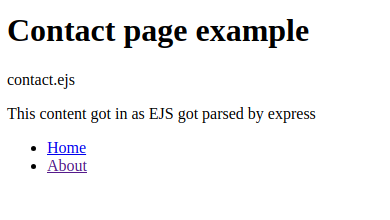

# Learning ExpressJS

- [Learning ExpressJS](#learning-expressjs)
  - [What is ExpressJS?](#what-is-expressjs)
  - [Basic plain node Server](#basic-plain-node-server)
  - [Getting starr with ExpressJS](#getting-starr-with-expressjs)
    - [Installing ExpressJS](#installing-expressjs)
    - [Creating first Express server](#creating-first-express-server)
  - [Handling routes, requests and responses](#handling-routes-requests-and-responses)
    - [Rendering HTML](#rendering-html)
    - [Redirecting](#redirecting)
    - [Route errors](#route-errors)
  - [View engine EJS](#view-engine-ejs)
    - [Installing EJS](#installing-ejs)
    - [Setup EJS](#setup-ejs)
    - [Creating view file for EJS](#creating-view-file-for-ejs)
    - [Rendering a view](#rendering-a-view)
    - [Partials](#partials)
  - [Middleware](#middleware)
    - [Middleware placement, code organization](#middleware-placement-code-organization)
    - [Creating a Logger middleware](#creating-a-logger-middleware)
  - [Public files - Static](#public-files---static)
  - [Snippet](#snippet)
  - [References](#references)

---

## What is ExpressJS?

**GPT: What is ExpressJS?**

> Express.js, commonly known as Express, is a minimal and flexible web application framework for Node.js. It provides a set of features for building web and mobile applications quickly and efficiently. Express is widely used in the Node.js community and is known for its simplicity, ease of use, and robust set of features
>
> **Key features**:
>
> 1. **Routing:** Simple and efficient route handling for various HTTP methods.
> 2. **Middleware:** Modular functions to handle aspects of the request-response cycle.
> 3. **Template Engines:** Support for various template engines like EJS, Pug, and Handlebars.
> 4. **Static File Serving:** Built-in middleware for serving static files easily.
> 5. **HTTP Utility Methods:** Simplifies working with HTTP requests and responses.
> 6. **RESTful API Development:** Ideal for designing and implementing RESTful APIs.
> 7. **Flexibility:** Minimalistic and unopinionated, allowing developers to structure applications as they prefer.
> 8. **Widely Adopted:** Popular and widely used in the Node.js community.
> 9. **Performance:** Lightweight and fast, suitable for building scalable applications.
> 10. **Ecosystem:** Large and vibrant ecosystem with numerous third-party middleware and extensions.

## Basic plain node Server

Below you can see a very basic server implementation using only Node, that will allow you to understand better how express works under the hood.

```js
//./src/basicNodeServerExample/server.js

const http = require("http");
const fs = require("fs");

const server = http.createServer((req, res) => {
    // Request object
    console.log(req.url, req.method);

    // Response object
    res.setHeader("Content-Type", "text/html");


    // Simple router implementation
    let path = "./views"

    switch (req.url) {
        case "/":
            // Success example
            statusCode = 200
            path += "/index.html"
            break;
        case "/about":
            // Success example
            res.statusCode = 200
            path += "/about.html"
            break;
        case "/about-me":
            // Redirect example
            res.statusCode = 301
            res.setHeader("Location", "/about")
            break;
        default:
            // Not existing endpoint example
            res.statusCode = 404
            path += "/404.html"
            break;
    }

    // Simple view engine implementation
    fs.readFile(path, (error, data) => {
        try {
            res.write(data)
        } catch (e) {
            console.log(e, error)
        } finally {
            res.end()
        }
    })
});

server.listen(5500, "localhost", () => {
    console.log("Listening for requests on port 5500");
});
```

> See an example project on: `./src/basicNodeServerExample/`

## Getting starr with ExpressJS

### Installing ExpressJS

```sh
yarn add express

# OR

npm install express
```

### Creating first Express server

Express doesn't require setup or anything, however you need to have a initial JS file that will instantiate the express on the project root folder, normally this file is called `app.js` or `server.js`, here is a simple example how to use express on this file:

```js
// app.js
const express = require('express')
const PORT = 5500 // It should use .env

// Creating express app
const app = express()

// Setup port to listen for requests
// Returns an instance of the server, which would be used if use websocket
const server = app.listen(PORT, () => {
    console.log(`Listening for requests on port ${PORT}`)
})

// Basic routes handling
app.get('/', (req, res) => {
  // Same as .write and .end
  res.send('Hello, Express!');
})
```

> I also added two functions to handle server process as we close it, look at [Closing server gracefully](../README.md#shutdown-server-gracefully)

## Handling routes, requests and responses

The simplest way to handle multiple endpoints would be to repeat the statement `app.get` like this:

```js
// app.js

//...

// Routes and endpoints handling
app.get("/", (req, res) => {

  // Same as .write and .end
  res.send('<p>Home page<p>')
})

app.get("/about", (req, res) => {

  // Same as .write and .end
  res.send('<p>About page<p>')
})

```

### Rendering HTML

On the example above we are sending as response html in a string, however express allow as to send a file not only strings:

```js
// app.js

...

// Routes and endpoints handling
app.get("/", (req, res) => {

  // sending a html file directly
  res.sendFile('./src/views/index.html', {root: __dirname})
})

app.get("/about", (req, res) => {

  // sending a html file directly
  res.sendFile('./src/views/about.html', {root: __dirname})
})

```

> **Notice:** that on the first argument we sent a relative path, however the function `sendFile`, uses absolute paths, so we add an options, as second argument, where we specify the root folder from our project
> Instead of `__dirname`  we could use also the `path` module that node provides.

### Redirecting

To make a redirect using express we will use the function `redirect`:

```js
// app.js

// Routes and endpoints handling

...

app.get("/about-us", (req, res) => {

  // sending a html file directly
  res.redirect('/about')
})
```

### Route errors

In this initial example we will use the `use` function just to handle the error, since our project is small there's no problem,
but the `use` function is used for middlewares, because it's triggered every request.

In our scenario just to ensure it will only send our 404 view when status is 404, we will use a function `status` checking
the status our response has chained with the `sendFile`

Later we will see it done differently

```js
// app.js

// Routes and endpoints handling

...

// rendering error page
app.use((req, res) => {
    res.status(404).sendFile('./src/views/404.html', { root: __dirname })
})
```

## View engine EJS

### Installing EJS

```js
yarn add -D ejs
```

### Setup EJS

Within the `app.js` we need to instantiate EJS and put  it to usage

```js
// app.js

// Creating express app

...

// Register view engine
app.set('view engine', 'ejs')
app.set('views', './src/views')

// Routes and endpoints handling

```

> **Notice:** that in our case we added a second statement because our `views` folder isn't directly on the root folder, so we need to specify the relative path where our `views` folder is

### Creating view file for EJS

To create EJS views, we will use 90% HTML syntax, however the file name will have the extension `ejs`,
the difference is that express will parse the file and if we use `<% %>` it will allow us run javascript
on the server side, which means we can make our view more dynamic, most parte of the we just want use it for variables
or simple scripts that our server needs to handle specific aspects from our view,

```html
<!-- views/index.ejs -->

<!DOCTYPE html>
<html lang="en">
  <head>
      <meta charset="UTF-8">
      <meta name="viewport" content="width=device-width, initial-scale=1.0">
      <title>ExpressJS example - contact</title>
  </head>

  <body>
      <main>
          <h1>Contact page example</h1>
          <p>contact.ejs</p>
          <p><%= content %></p>
      </main>

      <nav>
          <ul>
              <li><a href="/index">Home</a></li>
              <li><a href="/about">About</a></li>
          </ul>
      </nav>
  </body>
</html>
```

> **Notice:** that the only difference between HTML is really the usage of embedded Javascript `<%= content %>`

| Embed              | Description                                                                                                                                       |
| :----------------- | :------------------------------------------------------------------------------------------------------------------------------------------------ |
| `<% code_here %>`  | Executes JavaScript code without rendering it on the final HTML. Use for control flow or logic.                                                   |
| `<%= code_here %>` | Executes JavaScript code and renders its output on the final HTML. HTML-escapes the output to prevent XSS.                                        |
| `<%- code_here %>` | Executes JavaScript code and renders its output on the final HTML. Does not HTML-escape the output. Use when you trust the source of the content. |
| `<%# code_here %>` | Comments that won't render in the final HTML. Useful for adding comments within your EJS template.                                                |

### Rendering a view

To render a view with express we are going to use within the `get` a function called `render` from the response object we have:

```js
// app.js

...

// Routes and endpoints handling

...

app.get("/contact", (req, res) => {
    res.render('contact', { content: "This content got in as EJS got parsed by express" })
})
```

As use the function `render` has two arguments, 'contact' and an object {}, this object is where we send the variables
that our ejs view will use, so the output will  be like this:

**Output:**



### Partials

Since EJS are used to create multiple views it generate too much repeating code, to avoid that exist partials, that is small portions of code that can be included within a main EJS file so we don't have to keep rewriting code too much:

For instance, view you look or views, you will notice that it is constantly repeating the `head` and the `nav` elements, so without the usage of partial we would have to keep copying and pasting this code a lot, so we can make it become a partial, like this:

**Create partials folder:**

First lets create `/partials` folder

```tree
.
└── views
    ├── 404.html
    ├── about.html
    ├── contact.ejs
    ├── index.html
    └── partials
```

**Create partials and move code from `contact.ejs`:**

Within this folder let's create two `ejs` views, on for the `head` and the other for our `nav`

```tree
└── views
    ├── 404.html
    ├── about.html
    ├── contact.ejs
    ├── index.html
    └── partials
       └── partials
           ├── head.ejs
           └── nav.ejs
```

Now lets move the head from the `contact.ejs` view to the partial `head.ejs`

```html
<!-- partials/head.ejs -->
<head>
    <meta charset="UTF-8">
    <meta name="viewport" content="width=device-width, initial-scale=1.0">
    <title>ExpressJS example - <%= endpoint %></title>
</head>
```

> **Notice:** that i added a embed to render the variable `endpoint` to make our head more dynamic

```html
<!-- partials/nav.ejs -->
<nav>
    <ul>
        <li><a href="/index">Home</a></li>
        <li><a href="/about">About</a></li>
        <li><a href="/contact">Contact</a></li>
    </ul>
</nav>
```

> **Notice:** that there's a extra link for contact here

**Call and partials on `contact.ejs`:**

To include a partial we are going to used escaped javascript using `<%- %>` that will run and render the partial using the function `include`, like this:

```html
<!-- contact.ejs -->

<!DOCTYPE html>
<html lang="en">
  <%- include('./partials/head.ejs', {endpoint: 'contact' }) %>

  <body>
    <main>
      <h1>Contact page example</h1>
      <p>contact.ejs</p>
      <p><%= content %></p>
    </main>

    <%- include('./partials/nav.ejs') %>
  </body>
</html>
```

**Output:**


## Middleware

**GPT: What's a middleware?**

> Middleware is a software component that sits between a web application's request and response. It can execute code before and after the main processing of a request, modify requests and responses, and enhance or modify the application's behavior by performing specific tasks during the request-response cycle. It has
access to the request and response objects, allowing it to perform various functions such as checking user authentication, logging information, or handling errors.


On express to build a middleware we use the function `use`, technically our `get` function it's also a middleware since it works with and between request and response, however `get` only triggers if it's made get request, same as `post` function that triggers only for post requests, while `use` function is triggered for every request is made.

### Middleware placement, code organization

A very important point to emphasize is that middleware only works between request and response, therefore if we send a response back to the client before a middleware is trigger, the middleware left out will never be called, look an example:


Which means we must organize our code in such a way that our routes do not responds before a middleware if the middleware response should be trigger before such response.

In or example we are handling error view after all our gets, that's because our middleware should only return if no endpoint gets a response, meaning that that page doesn't exists:

```js
// app.js

...

// Routes and endpoints handling
app.get("/", (req, res) => {
    res.sendFile('./src/views/index.html', { root: __dirname })
})

app.get("/about", (req, res) => {
    res.sendFile('./src/views/about.html', { root: __dirname })
})

app.get("/about-us", (req, res) => {
    res.redirect('/about')
})

app.get("/contact", (req, res) => {
    res.render('contact', { content: "This content got in as EJS got parsed by express" })
})

// Only will be reached if no response has been sent
app.use((req, res) => {
    res.status(404).sendFile('./src/views/404.html', { root: __dirname })
})
```

### Creating a Logger middleware

Create a middleware is pretty simple with express, we just need find the right placement and add call the `use` function, on this example we need to log data from request before it gets any response, so the right place for it will be before our routes handlers:

```js
// Register view engine

...

// Middlewares
// Logger
app.use((req, res, next) => {
  let log = ` => ${req.method} ${req.url}, Parameters: ${JSON.stringify(req.params)}`;

  console.log(log);
  next();
});

// Routes and endpoints handling
```

> **Notice:** that for this middleware we not only got as argument request and response, but also a `next` a function that allows the application to move on, so each can reach our routes handlers and produce a response.

If we want to increment our logs and use a third-party lib like [morgan](https://github.com/expressjs/morgan) for instance.

## Public files - Static

To be able to allow out client to access files static files like assets or images, we need to setup our server like this:

```js
// Middlewares
// Static files

app.use(express.static('public'))
```

The argument `'public'` specify a folder where our static files will be available publicly to the client

```tree
.
├── public
└── src
    ├── assets
    │   └── images
    └── views
        └── partials
```

So every file within the public folder can be used on the clients browser, so we can use a builder to output processed files directly there or we could put the files we  want directly there, something like images ou css, all that would be available to the client

## Snippet

## References

[Express](https://expressjs.com/)
[EJS view engine](https://ejs.co/)
[Express node Crash Course](https://www.youtube.com/playlist?list=PL4cUxeGkcC9jsz4LDYc6kv3ymONOKxwBU)
