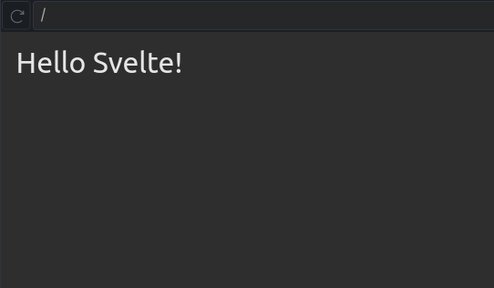

# Learning Svelte

Svelte is a tool for building web applications. Like other user interface frameworks, it allows you to build your app declaratively out of components that combine markup, styles and behaviors.

These components are compiled into small, efficient JavaScript modules that eliminate overhead traditionally associated with UI frameworks.

- [Learning Svelte](#learning-svelte)
  - [Installation and setup](#installation-and-setup)
  - [Svelte basics](#svelte-basics)
    - [Basic Javascript interpolation](#basic-javascript-interpolation)
    - [Basic CSS styling](#basic-css-styling)
    - [Basic component nesting](#basic-component-nesting)
    - [svelte intrusive injection](#svelte-intrusive-injection)
    - [Svelte Reactivity](#svelte-reactivity)
      - [Assign and Reassigning states](#assign-and-reassigning-states)
      - [Interacting with mutation](#interacting-with-mutation)
      - [Derived state](#derived-state)
    - [Statements](#statements)
      - [If statements](#if-statements)
      - [Each statements](#each-statements)
      - [Promise statements](#promise-statements)
    - [Events](#events)
      - [Handling events](#handling-events)
      - [Events modifiers](#events-modifiers)
      - [Component events](#component-events)
    - [Bindings](#bindings)
      - [Binding simple input values](#binding-simple-input-values)
      - [Binding `contenteditable` elements](#binding-contenteditable-elements)
      - [Binding media elements `<video>`, `audio`](#binding-media-elements-video-audio)
      - [Binding element dimensions](#binding-element-dimensions)
      - [Binding `this`](#binding-this)
      - [Component Binds](#component-binds)
    - [Svelte components LifeCycle](#svelte-components-lifecycle)
    - [Svelte Stores](#svelte-stores)

## Installation and setup

Svelte usage through Vite is highly recommended

**Installation:**

```sh
npm install svelte
# yarn add svelte
# bun add svelte
```

**Installation using create:**

```sh
npm create svelte@latest myapp
```

**Installation through vite:**

```sh
# By Creating new project

npm create vite@latest my-svelte-app --template svelte
# yarn create vite my-svelte-app --template svelte
# bun create vite my-svelte-app --template svelte

# Using Vite you can already start the development server
npm run dev  # npm  
# yarn dev  
# bun dev  
```

It will produce this project structure:

```tree
my-svelte-app/
├── node_modules/         # Installed dependencies
├── public/               # Static assets (favicon, images, etc.)
│   ├── favicon.png
│   └── index.svelte        # Main entry point
├── src/                  # Application source code
│   ├── lib/              # Reusable components & utilities
│   ├── routes/           # Page components (if using SvelteKit)
│   ├── App.svelte        # Root component
│   ├── main.js           # Entry script
│   └── styles.css        # Global styles (optional)
├── .gitignore            # Git ignore rules
├── package.json          # Project metadata & dependencies
├── README.md             # Project documentation
├── svelte.config.js      # Svelte configuration file
├── vite.config.js        # Vite configuration (if using Vite)
└── tsconfig.json         # TypeScript config (if using TypeScript)

```

Now open **<http://localhost:5173>** in your browser to see your Svelte app.

## Svelte basics

### Basic Javascript interpolation

First we need to create any svelte component file, if not created by the Vite project template:

```sh
touch App.svelte
```

Latter we can implement like this:

```svelte
<!-- my-svelte-basic/App.svelte -->
<script>
 let name = 'Svelte'
</script>

<h1>Hello {name}!</h1>
```

It will render:



Inside the curly braces we can add any JS function we want to, like so:

```svelte
<script>
  let name = 'Svelte';
</script>

<h1>Hello {name.toUpperCase()}!</h1>
```

It will produce the name string as uppercase

Svelte is actually very straightforward

```svelte
<!-- my-svelte-basic/App.svelte -->
<script>
  let src = './src/assets/images/image.gif';
  let name = 'Ricky Ashley';
</script>


```

### Basic CSS styling

Just like in svelte, you can add a `<style>` tag to your component. Let’s add some styles to the `<p>` element:

```svelte
<p>This is a paragraph.</p>

<style>
 p {
  color: goldenrod;
  font-family: 'Comic Sans MS', cursive;
  font-size: 2em;
 }
</style>
```

> By convention Scrips prepends the svelte content and styling appends the svelte content

### Basic component nesting

```jsx
<script>
 import Nested from './Nested.svelte'
</script>

<p>This is a paragraph.</p>
<Nested />

<style>
 p {
  color: goldenrod;
  font-family: 'Comic Sans MS', cursive;
  font-size: 2em;
 }
</style>
```

> Svelte uses JSX by default?!

### svelte intrusive injection

Be aware Svelte allow unsafe svelte injection through JS, but it doesn't provide any sanitation, or safety measures, so use it wisely, otherwise you risk exposing your users to **Cross-Site Scripting (XSS)** attacks.

**Using plain interpolation:**

```svelte
<script>
 let string = `this string contains some <strong>svelte!!!</strong>`;
</script>

<p>{string}</p>
```


**Using special tag `@svelte`:**

```svelte
<script>
 let string = `this string contains some <strong>svelte!!!</strong>`;
</script>

<p>{@svelte string}</p>
```


### Svelte Reactivity

Svelte is a powerful system of reactivity for keeping the DOM in sync with your application state.

#### Assign and Reassigning states

**Using `$:` (reactive statements):**

```svelte
<script>
  let count = 0;

  // `$:` makes this reactive, so `doubled` updates automatically.
  $: doubled = count * 2;
</script>

<p>Count: {count}</p>
<p>Doubled: {doubled}</p>

<button on:click={() => count++}>Increment</button>
```

**Using Svelte Stores:**

```svelte
<script>
  import { writable } from 'svelte/store';

  const count = writable(0);
</script>

<button on:click={() => count.update(n => n + 1)}>
  Count: {$count}
</button>
```

**Using `$state` rune (Svelte 5 and above):**

`$state` is called rune, it will create all we need to manage state similarly with React `useState`, runes are basically built-in functions or statements that belongs to the Svelte 5 lib

```svelte
<script>
 let count = $state(0);

 function increment() {
  count += 1;
 }
</script>

<button onclick={increment}>
 Clicked {count}
 {count === 1 ? 'time' : 'times'}
</button>
```

#### Interacting with mutation

```svelte
<script>
  let numbers = [1, 2, 3, 4];

  function addNumber() {
    numbers = [...numbers, numbers.length + 1]; // Triggers reactivity
  }
</script>

<p>{numbers.join(' + ')} = {numbers.reduce((a, b) => a + b, 0)}</p>

<button on:click={addNumber}>
  Add a number
</button>
```

> In this case we don't need to use `$:`
>
> **When to use `$:`?**
>
> - Use `$:` when you want to derive new state from other state, and the derived value needs to be stored separately for further use, optimization, or clarity.
> - In this case, the sum is directly calculated in the template, so no `$:` is necessary. You could just use the reduce method in the template as shown.

**Using `$state` rune (Svelte 5 and above):**

```svelte
<script>
 let numbers = $state([1, 2, 3, 4]);

 function addNumber() {
  numbers[numbers.length] = numbers.length + 1;
 }
</script>

<p>{numbers.join(' + ')} = ...</p>

<button onclick={addNumber}>
 Add a number
</button>
```

> ...the component updates. Or better still, we can push to the array instead:
>
> ```js
>  function addNumber() {
>   numbers.push(numbers.length + 1)
>  }
> ```

#### Derived state

### Statements

#### If statements

```svelte
<script>
 let user = { loggedIn: false };

 function toggle() {
  user.loggedIn = !user.loggedIn;
 }
</script>

{#if user.loggedIn}
<button on:click={toggle}> Log out </button>
{/if}

{#if !user.loggedIn}
<button on:click={toggle}> Log in </button>
{/if}
```

**Using else statement:**

```svelte
<script>
 let user = { loggedIn: false };

 function toggle() {
  user.loggedIn = !user.loggedIn;
 }
</script>

{#if user.loggedIn}
<button on:click={toggle}> Log out </button>
{:else}
<button on:click={toggle}> Log in </button>
{/if}
```

**else if:**

```svelte
<script>
 let x = 4;
</script>

{#if x > 10}
 <p>{x} is greater than 10</p>
{:else if 5 > x}
 <p>{x} is less than 5</p>
{:else}
 <p>{x} is between 5 and 10</p>
{/if}
```

#### Each statements

```svelte
<script>
 let cats = [
  { id: 'J---aiyznGQ', name: 'Keyboard Cat' },
  { id: 'z_AbfPXTKms', name: 'Maru' },
  { id: 'OUtn3pvWmpg', name: 'Henri The Existential Cat' }
 ];
</script>

<h1>The Famous Cats of YouTube</h1>

<ul>
 {#each cats as cat}
 <li>
  <a target="_blank" href="https://www.youtube.com/watch?v={cat.id}" rel="noreferrer">
   {cat.name}
  </a>
 </li>
 {/each}
</ul>
```

> If you prefer, you can use destructuring — each cats as { id, name } — and replace cat.id and cat.name with id and name.

**Mutate Array of objects:**

```svelte
<script>
 import Thing from './Thing.svelte';

 let things = [
  { id: 1, name: 'apple' },
  { id: 2, name: 'banana' },
  { id: 3, name: 'carrot' },
  { id: 4, name: 'doughnut' },
  { id: 5, name: 'egg' }
 ];

 function handleClick() {
  things = things.slice(1);
 }
</script>

<button on:click={handleClick}> Remove first thing </button>

{#each things as thing (thing.id)}
 <Thing name={thing.name} />
{/each}
```

> Notice the change on the each statement, sending a key `(thing.id)` to allow Svelte to find out what element it should really "change?!"

#### Promise statements

Most web applications have to deal with asynchronous data at some point. Svelte makes it easy to await the value of promises directly in your markup:

```svelte
<script>
 async function getRandomNumber() {
  const res = await fetch(`/tutorial/random-number`);
  const text = await res.text();

  if (res.ok) {
   return text;
  } else {
   throw new Error(text);
  }
 }

 let promise = getRandomNumber();

 function handleClick() {
  promise = getRandomNumber();
 }
</script>

<button on:click={handleClick}> generate random number </button>

{#await promise}
 <p>...waiting</p>
{:then number}
 <p>The number is {number}</p>
{:catch error}
 <p style="color:red">{error.message}}</p>
{/await}

```

Shortened version:

```svelte
{#await promise then number}
 <p>the number is {number}</p>
{/await}
```

### Events

#### Handling events

```svelte
<script>
 let m = { x: 0, y: 0 };

 function handleMousemove(event) {
  m.x = event.clientX;
  m.y = event.clientY;
 }
</script>

<div on:mousemove={handleMousemove}>
 The mouse position is {m.x} x {m.y}
</div>

<style>
 div {
  width: 100%;
  height: 100%;
 }
</style>

```

**Handling events inline:**

```svelte
<script>
 let m = { x: 0, y: 0 };

 function handleMousemove(event) {
  m.x = event.clientX;
  m.y = event.clientY;
 }
</script>

<div on:mousemove={(e) => (m = {x: e.clientX, y: e.clientY})}>
 The mouse position is {m.x} x {m.y}
</div>

<style>
 div {
  width: 100%;
  height: 100%;
 }
</style>
```

#### Events modifiers

DOM event handlers can have modifiers that alter their behavior

```svelte
<script>
 function handleClick() {
  alert('clicked');
 }
</script>

<button on:click|once={handleClick}> Click me </button>
```

**List of existing modifiers:**

- `preventDefault` — calls event.preventDefault() before running the handler. Useful for client-side form handling, for example.
- `stopPropagation` — calls event.stopPropagation(), preventing the event reaching the next element
- `passive` — improves scrolling performance on touch/wheel events (Svelte will add it automatically where it's safe to do so)
- `nonpassive` — explicitly set passive: false
- `capture` — fires the handler during the capture phase instead of the bubbling phase (MDN docs)
- `once` — remove the handler after the first time it runs
- `self` — only trigger handler if event.target is the element itself
- `trusted` — only trigger handler if event.isTrusted is true. I.e. if the event is triggered by a user action.

> You can chain modifiers together, e.g. `on:click|once|capture={...}`

#### Component events

Components can also dispatch events. To do so, they must create an event dispatcher. Update Inner.svelte:

```svelte
<script>
 import { createEventDispatcher } from 'svelte';

 const dispatch = createEventDispatcher();

 function sayHello() {
  dispatch('message', {
   text: 'Hello!'
  });
 }
</script>
```

**Forward events between components:**

```svelte
<!-- Inner.svelte -->
 <script>
 import { createEventDispatcher } from 'svelte';

 const dispatch = createEventDispatcher();

 function sayHello() {
  dispatch('message', {
   text: 'Hello!'
  });
 }
</script>

<button on:click={sayHello}> Click to say hello </button>

<!-- Outer.svelte -->
<script>
 import Inner from './Inner.svelte';
 import { createEventDispatcher} from 'svelte'

 const dispatch = createEventDispatcher();

 function forward(event) {
  dispatch('message', event.detail)
 }
</script>

<Inner on:message={forward}/>

<!-- App.svelte -->
 <script>
 import Outer from './Outer.svelte';

 function handleMessage(event) {
  alert(event.detail.text);
 }
</script>

<Outer on:message={handleMessage} />
```

Boring right!? That's what happens under the hood, but you could simple do this way:

```svelte
<!-- Outer.svelte -->
<script>
 import Inner from './Inner.svelte';

</script>

<Inner on:message/>
```

> Notice DOM events can also be forwarded between components

### Bindings

#### Binding simple input values

**Inputs:**

```svelte
<script>
 let name = 'world';
</script>

<input bind:value={name} />

<h1>Hello {name}!</h1>
```

**Textarea:**

```svelte
<script>
 let value = `Some words are *italic*, some are **bold**`;
</script>

<p>{value}</p>

<textarea bind:value={value} />

<!-- Shortened: -->
<!-- <textarea bind:value /> -->

<style>
 textarea {
  width: 100%;
  height: 200px;
 }
</style>
```

**Numeric inputs:**

With bind:value, Svelte takes care of it for you:

```svelte
<script>
 let a = 1;
 let b = 2;
</script>

<label>
 <input type="number" bind:value={a} min="0" max="10" />
 <input type="range" bind:value={a} min="0" max="10" />
</label>

<label>
 <input type="number" bind:value={b} min="0" max="10" />
 <input type="range" bind:value={b} min="0" max="10" />
</label>

<p>{a} + {b} = {a + b}</p>
```

**Checkboxes:**

Instead of binding to input.value, we bind to input.checked:

```svelte
<script>
 let yes = false;
</script>

<label>
 <input type="checkbox" bind:checked={yes} />
 Yes! Send me regular email spam
</label>

{#if yes}
 <p>Thank you. We will bombard your inbox and sell your personal details.</p>
{:else}
 <p>You must opt-in to continue. If you're not paying, you're the product.</p>
{/if}

<button disabled={!yes}> Subscribe </button>
```

**Input groups:**

Simple group binding

```svelte
<script>
 let scoops = 1;
</script>

<h2>Size</h2>

<label>
 <input type="radio" bind:group={scoops} name="scoops" value={1} />
 One scoop
</label>

<label>
 <input type="radio" bind:group={scoops} name="scoops" value={2} />
 Two scoops
</label>

<label>
 <input type="radio" bind:group={scoops} name="scoops" value={3} />
 Three scoops
</label>

<p>{scoops} scoops</p>
```

Binding groups iterating with array

```svelte
<script>
 let flavours = ['Mint choc chip'];
 let menu = ['Cookies and cream', 'Mint choc chip', 'Raspberry ripple'];

 function join(flavours) {
  if (flavours.length === 1) return flavours[0];
  return `${flavours.slice(0, -1).join(', ')} and ${flavours[flavours.length - 1]}`;
 }
</script>

<h2>Flavours</h2>

{#each menu as flavour }
  <label>
  <input type="checkbox" bind:group={flavours} name="flavours" value={flavour} />
  {flavour}
  </label>
{/each}
```

**Selects and options:**

```svelte
<script>
  let states = [
    { id: 1, option: 'Bahia' },
    { id: 2, option: 'Santa Catarina' },
    { id: 3, option: 'São Paulo' },
  ];

  let selected;
</script>

<h2>Choose a Brazilian state:</h2>

<select bind:value={selected}>
  {#each states as states}
    <option value={states}>
      {states.option}
    </option>
  {/each}
</select>

<p>Selected state: {selected ? selected.option : '[waiting...]'}</p>

<style>
  input {
    display: block;
    width: 500px;
    max-width: 100%;
  }
</style>
```

**Multiple select:**

```svelte
<script>
  let flavours = ['Mint choc chip'];
  let menu = ['Cookies and cream', 'Mint choc chip', 'Raspberry ripple'];
</script>

<h2>Flavours</h2>

<select multiple bind:value={flavours}>
  {#each menu as flavour}
    <option value={flavour}>
      {flavour}
    </option>
  {/each}
</select>
```

#### Binding `contenteditable` elements

Elements with the contenteditable attribute support **ONLY** the following bindings:

- innerHTML
- innerText
- textContent

**InnerHTML example:**

```svelte
<script>
 let html = '<p>Write some text!</p>';
</script>

<div contenteditable="true" bind:innerHTML={html} />

<pre>{html}</pre>

<style>
 [contenteditable] {
  padding: 0.5em;
  border: 1px solid #eee;
  border-radius: 4px;
 }
</style>
```

#### Binding media elements `<video>`, `audio`

The complete set of bindings as follows

**Readonly bindings:**

- `duration` — the total duration of the video, in seconds
- `buffered` — an array of {start, end} objects
- `seekable` — ditto
- `played` — ditto
- `seeking` — boolean
- `ended` — boolean

**two-way bindings:**

- `currentTime` — the current point in the video, in seconds
- `playbackRate` — how fast to play the video, where 1 is 'normal'
- `paused` — this one should be self-explanatory
- `volume` — a value between 0 and 1
- `muted` — a boolean value where true is muted
- `Videos` additionally have readonly videoWidth and videoHeight bindings.

```svelte
<video
 poster="https://sveltejs.github.io/assets/caminandes-llamigos.jpg"
 src="https://sveltejs.github.io/assets/caminandes-llamigos.mp4"
 on:mousemove={handleMove}
 on:touchmove|preventDefault={handleMove}
 on:mousedown={handleMousedown}
 on:mouseup={handleMouseup}
 bind:currentTime={time}
 bind:duration
 bind:paused
>
 <track kind="captions" />
</video>
```

#### Binding element dimensions

Every block-level element has clientWidth, clientHeight, offsetWidth and offsetHeight bindings:

```svelte
<script>
 let w;
 let h;
 let size = 42;
 let text = 'edit me';
</script>

<input type="range" bind:value={size} />
<input bind:value={text} />

<p>size: {w}px x {h}px</p>

<div bind:clientWidth={w} bind:clientHeight={h}>
 <span style="font-size: {size}px">{text}</span>
</div>

<style>
 input {
  display: block;
 }
 div {
  display: inline-block;
 }
 span {
  word-break: break-all;
 }
</style>

```

#### Binding `this`

The readonly this binding applies to every element (and component) and allows you to obtain a reference to rendered elements. For example, we can get a reference to a `<canvas>` element:

```svelte
<canvas bind:this={canvas} width={32} height={32} />

```

#### Component Binds

**Binding component props:**

Just as you can bind to properties of DOM elements, you can bind to component props (variables that has export directive on it).

```svelte
<!-- App.svelte -->
<script>
  import MessageBox from '../components/MessageBox.svelte';
  let body;
</script>

<input type="text" bind:value={body} />

<MessageBox bind:body />

<!-- Component MessageBox.svelte -->

<script>
  import { createEventDispatcher } from 'svelte';

  let title = 'This is a default title';
  export let body = 'This is a default message';
</script>

<div>
  <h2>{title}</h2>

  <div>
    {body}
  </div>
</div>
```

**Binding component itself:**

```svelte
<!-- Component -->
 <script>
 let input;

 export function focus() {
  input.focus();
 }
</script>

<input bind:this={input} />


<!-- App.svelte -->
<script>
 import InputField from './InputField.svelte';

 let field;
</script>

<InputField bind:this={field} />

<button on:click={() => field.focus()}>Focus field</button>
```

### Svelte components LifeCycle

lifecycle functions allow you to hook into a component's lifecycle. Here are the main ones:  

**onMount:**

```svelte
<script>
  import { onMount } from 'svelte';

  onMount(() => {
    console.log('Component mounted!');
  });
</script>
```

**beforeUpdate:**

```svelte
<script>
  import { beforeUpdate } from 'svelte';

  let count = 0;

  beforeUpdate(() => {
    console.log('Before update:', count);
  });
</script>

<button on:click={() => count++}>Increment</button>
```

**afterUpdate:**

```svelte
<script>
  import { afterUpdate } from 'svelte';

  let count = 0;

  afterUpdate(() => {
    console.log('After update:', count);
  });
</script>

<button on:click={() => count++}>Increment</button>
```

**onDestroy:**

```svelte
<script>
  import { onDestroy } from 'svelte';

  onDestroy(() => {
    console.log('Component destroyed!');
  });
</script>
```

**tick:**

The tick function is unlike other lifecycle functions in that you can call it any time, not just when the component first initializes. It returns a promise that resolves as soon as any pending state changes have been applied to the DOM (or immediately, if there are no pending state changes).

```svelte
<script>
  import { tick } from 'svelte';

  let count = 0;

  async function update() {
    count++;
    await tick(); // Ensures DOM is updated before continuing
    console.log('DOM updated, new count:', count);
  }
</script>

<button on:click={update}>Increment</button>
```

**Summary:**

| Function     | When It Runs                         | Use Case                                    |
| ------------ | ------------------------------------ | ------------------------------------------- |
| onMount      | When component is first added to DOM | Fetching data, setting up listeners         |
| beforeUpdate | Before DOM updates                   | Tracking state before re-render             |
| afterUpdate  | After DOM updates                    | Running code after re-render                |
| onDestroy    | When component is removed            | Cleanup (listeners, intervals)              |
| tick         | Waits for next DOM update            | Ensuring DOM is updated before running code |

### Svelte Stores

**Svelte stores vs React Context:**

Svelte stores and React Context serve similar purposes (state management and sharing data between components), but they work differently

| Feature        | Svelte Stores                        | React Context                                        |
| -------------- | ------------------------------------ | ---------------------------------------------------- |
| Purpose        | Global state management              | Prop drilling alternative (not a full state manager) |
| API Complexity | Simple (`writable()`, `$store`)      | Requires `createContext()`, `useContext()`           |
| Reactivity     | Automatic (`$store` syntax)          | Requires `useState` or `useReducer`                  |
| Performance    | Efficient (only updates subscribers) | Can cause unnecessary re-renders                     |
| Setup          | Built-in (`svelte/store`)            | Requires Context API & Provider                      |

```svelte
<!-- // store.js -->
import { writable } from 'svelte/store';

export const count = writable(0); // Global state

<!-- App.svelte -->
<script>
  import { count } from './store.js';
</script>

<p>Count: {$count}</p> <!-- Auto-reactive binding -->

<button on:click={() => count.update(n => n + 1)}>
  Increment
</button>
```

> You can access and update the store inside any component using $storeName:
